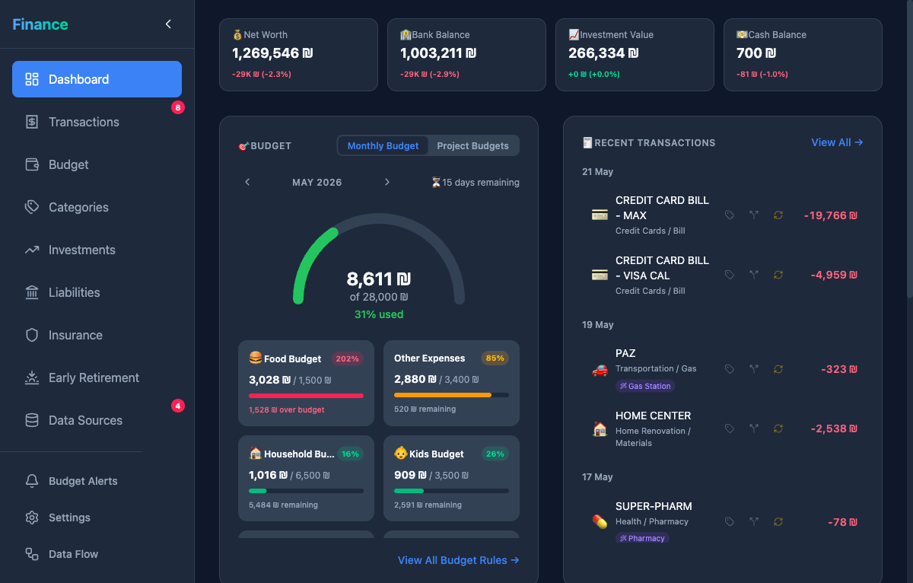
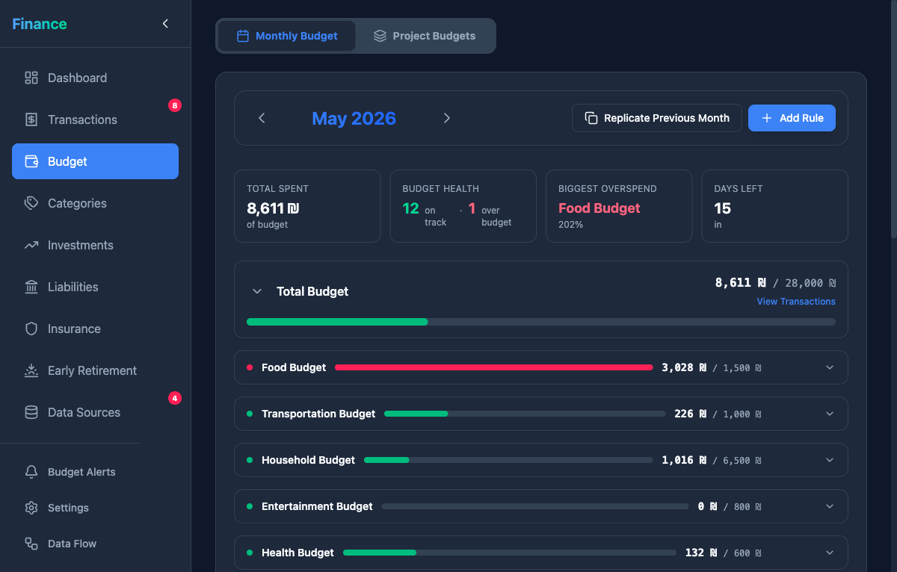
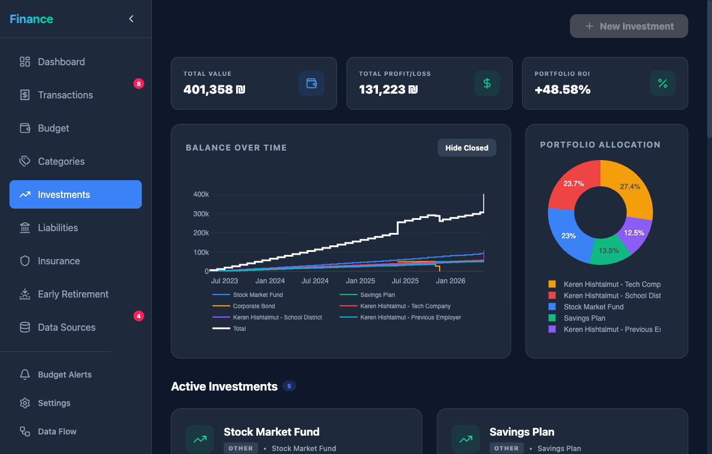

<div align="center">

# Finance Analysis

**The personal finance dashboard built for Israeli households.**

<p>
  
  
  
  
  
  
  
  
  
  
</p>

<a href="https://github.com/tomerroditi/finance-analysis/releases/latest/download/FinanceAppInstaller.exe">
  
</a>

<p><strong>macOS:</strong> <a href="#build-from-source-macos">build from source ↓</a> (Apple's Gatekeeper blocks unsigned downloads on macOS 15+, so a notarized installer would need an Apple Developer ID; until then the source build is the only path)</p>

<p>🌐 <strong><a href="https://finance-analysis.tomerroditi.workers.dev">Live demo → finance-analysis.tomerroditi.workers.dev</a></strong></p>

</div>

---



<p align="center"><em>Dashboard — net worth, budget overview, and recent transactions at a glance</em></p>

<br>

| Budget | Investments |
|--------|-------------|
|  |  |

---

## Build from source

```bash
# 1. Backend
python3.12 -m venv .venv && source .venv/bin/activate
pip install poetry && poetry install --no-root

# 2. Frontend
cd frontend && npm install && cd ..

# 3. Run
poetry run uvicorn backend.main:app --reload   # http://localhost:8000
cd frontend && npm run dev                      # http://localhost:5173
```

> **Try demo mode first.** Toggle it in the sidebar to explore all features with sample data — the "Cohen family" — without connecting real accounts.

<a id="build-from-source-macos"></a>
### Packaged .app for macOS

If you want a single double-clickable bundle on macOS (instead of running two dev servers), build it locally:

```bash
# One-time: install dependencies (same as above, plus the build group)
python3.12 -m venv .venv && source .venv/bin/activate
pip install poetry && poetry install --no-root --with build
cd frontend && npm install && cd ..

# Build the .app — output: dist/Finance Analysis.app
python build/build_app.py --no-wrap

# Move it to /Applications
mv "dist/Finance Analysis.app" /Applications/
```

Then launch it from Spotlight or Launchpad. Because you built it locally, the bundle has no `com.apple.quarantine` extended attribute, so Gatekeeper allows the ad-hoc-signed binary to run with no warnings.

> **Why no .dmg download?** Apple's macOS Tahoe (26.x) blocks unsigned downloaded apps at every entry point — `.app`, `.pkg`, and `.command` files all show a dead-end "cannot verify" dialog with no Open button. The only fixes are Apple Developer ID + notarization ($99/yr) or a Terminal one-liner to strip the quarantine flag. Until the project invests in signing, building locally is the cleanest path.

---

## Stack

| Layer | Tech |
|-------|------|
| Backend | FastAPI + SQLAlchemy + SQLite + Pandas |
| Frontend | React 19 + Vite + TypeScript + Tailwind CSS 4 |
| Scraper | Playwright + httpx (18 Israeli providers) |
| State | TanStack Query + Zustand |
| Tests | pytest + vitest + Playwright e2e |
| Packaging | NSIS installer (Windows) · local source build (macOS) |

---

## Contributing

- Conventional Commits via Commitizen — `cz commit` is your friend
- PRs target `dev`, not `main`
- CI runs pytest + lint + build + vitest on every PR
- Read `.claude/rules/` before changing an architecture layer for the first time

Detailed architecture, conventions, and gotchas live in [`CLAUDE.md`](./CLAUDE.md) and `.claude/rules/`.
