# Data Flow Architecture

How data moves through the Finance Analysis system — from external sources to user-facing dashboards.

---

## High-Level Overview

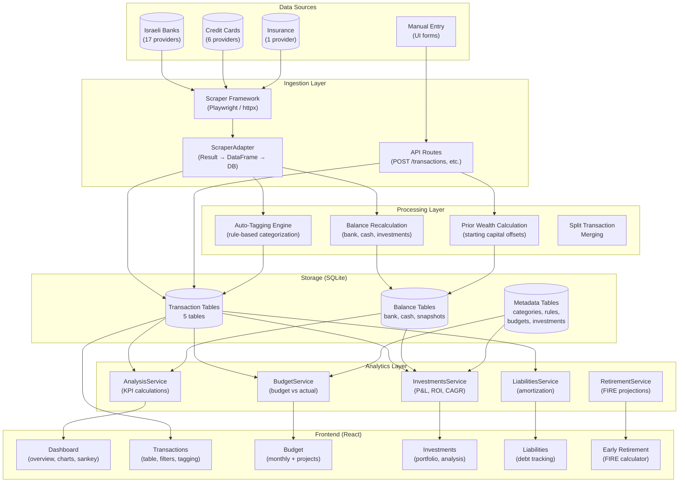

---

## 1. Data Sources & Ingestion

### Where Data Comes From

| Source | Method | Frequency | What It Produces |
|--------|--------|-----------|------------------|
| **Banks** (Hapoalim, Leumi, Discount, etc.) | Playwright browser scraping | On-demand (daily limit) | Account transactions + balance |
| **Credit Cards** (Max, Visa Cal, Isracard, etc.) | Playwright browser scraping | On-demand (daily limit) | Itemized purchases |
| **Insurance** (Hafenix) | Playwright browser scraping | On-demand | Pension/savings transactions + metadata |
| **Manual Cash** | UI form → `POST /transactions/` | User-initiated | Cash transactions |
| **Manual Investments** | UI form → `POST /transactions/` | User-initiated | Investment deposit/withdrawal records |
| **Balance Entry** | UI form → `POST /cash_balances/` or `POST /bank_balances/` | After scraping or manually | Current balance → prior wealth offset |

### Scraping Pipeline

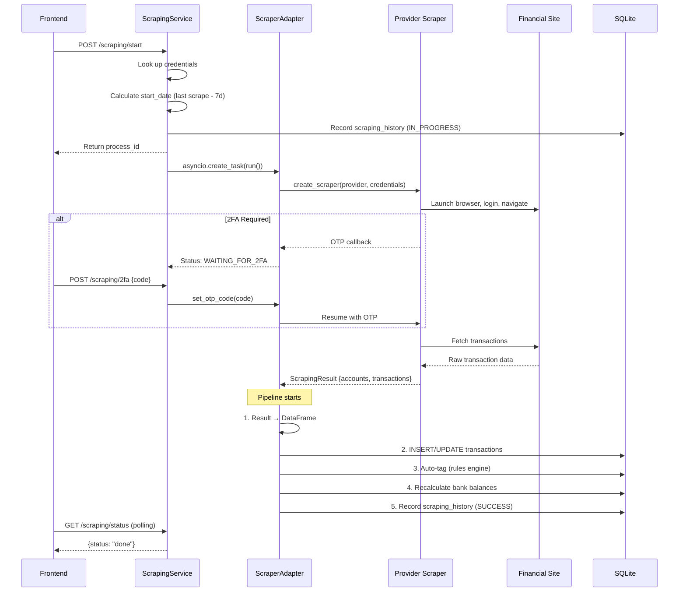

### Transaction Data Shape

Every transaction, regardless of source, is normalized to this schema:

```
unique_id       Auto-increment PK (internal)
id              Original provider ID
date            YYYY-MM-DD
amount          Negative = expense, Positive = income
description     Transaction description
provider        e.g., "hapoalim", "max"
account_name    User-given name for the account
account_number  Provider account number
category        e.g., "Food", "Transport" (null if untagged)
tag             e.g., "Groceries", "Gas" (null if untagged)
source          Table name: bank_transactions, credit_card_transactions, etc.
type            "normal" or "split_parent"
status          "completed" or "pending"
```

---

## 2. Storage Schema

### Transaction Tables (5 parallel tables, identical schema)

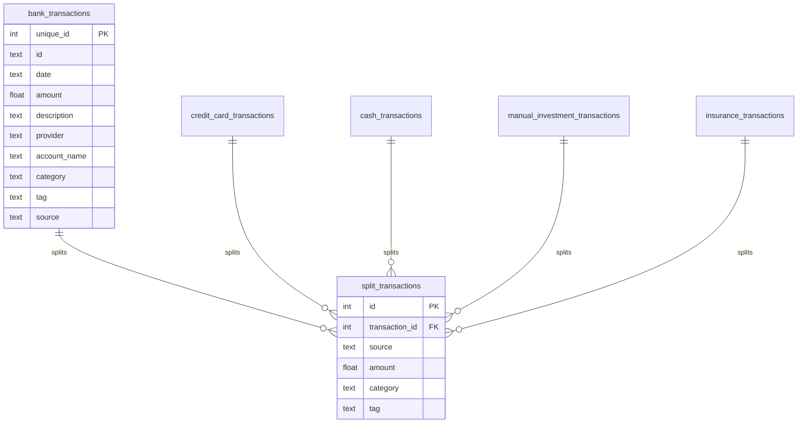

### Balance & Metadata Tables

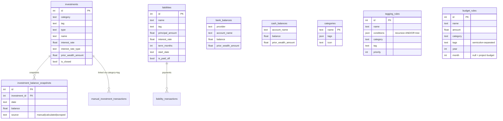

---

## 3. Processing Layer

### Auto-Tagging Engine

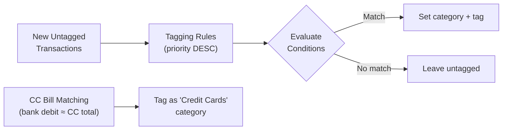

**Rule conditions** are recursive trees supporting:
- **Operators:** AND, OR, CONDITION
- **Fields:** description, account_name, provider, amount
- **Comparisons:** contains, equals, starts_with, gt, lt, between

**CC bill auto-tagging** matches bank debits to monthly CC totals (shifted +1 month, ±0.01 tolerance).

### Prior Wealth Calculation

Prior wealth bridges the gap between "system started tracking" and "actual account balance":

```
prior_wealth = user_entered_balance - sum(all_tracked_transactions)
```

| Account Type | When Calculated | Stored In |
|-------------|-----------------|-----------|
| **Bank** | User enters balance after scraping | `bank_balances.prior_wealth_amount` |
| **Cash** | User enters balance via UI | `cash_balances.prior_wealth_amount` |
| **Investments** | From investment transactions | `investments.prior_wealth_amount` |

Prior wealth is injected as **synthetic transaction rows** (tag: "Prior Wealth") into analysis DataFrames so it flows through all KPI calculations consistently.

### Split Transactions

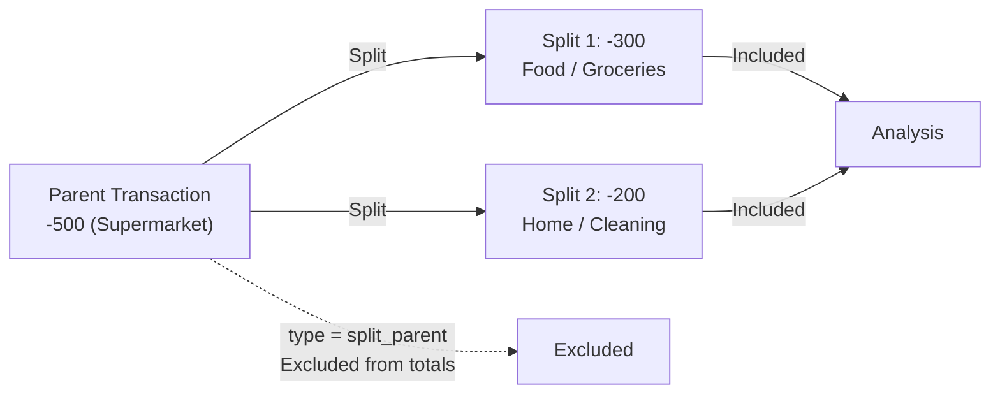

Parent stays in the main table (marked `type=split_parent`). Splits live in `split_transactions`. The service layer merges them for analysis, replacing parents with their splits.

---

## 4. Credit Card Deduplication

The most critical data flow concern. Two overlapping views of CC spending exist:

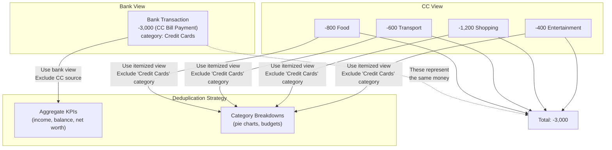

| Use Case | Strategy | Implementation |
|----------|----------|----------------|
| Total income/expenses | Bank view only | Filter `source != credit_card_transactions` |
| Net balance / net worth | Bank view only | `exclude_services=["credit_card_transactions"]` |
| Expense by category | Itemized CC view | Exclude "Credit Cards" category from bank txns |
| Sankey flow | Hybrid | Calculate CC gap, show as "Unknown" |

---

## 5. Analytics & KPI Calculations

### AnalysisService Data Flow

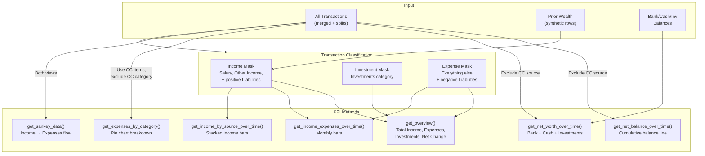

### Investment KPI Flow

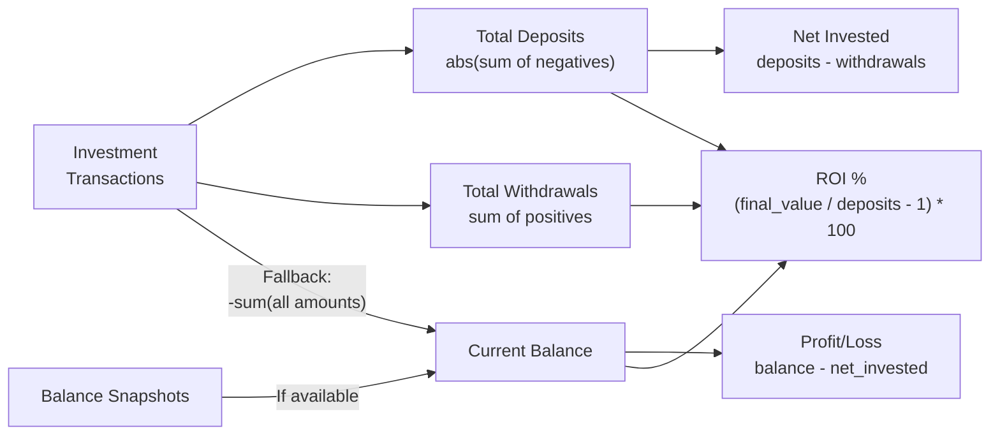

### Budget Analysis Flow

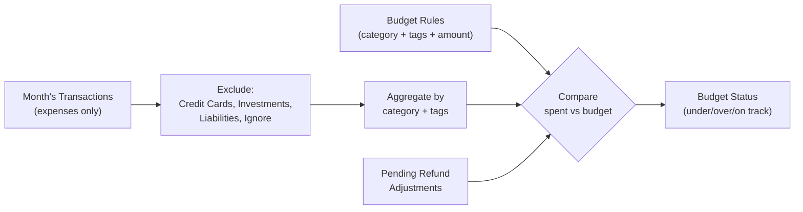

---

## 6. Frontend Data Consumption

### API → UI Pipeline

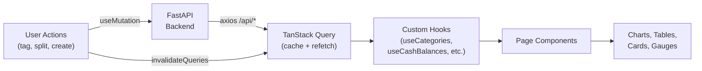

### What Each Page Fetches

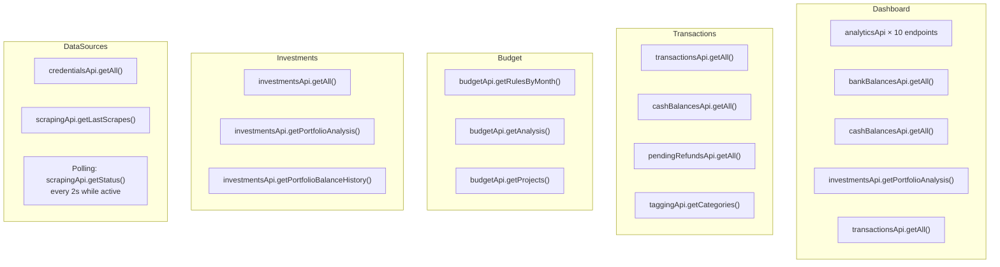

### Cache Invalidation Strategy

When a mutation occurs, only affected queries are invalidated:

| Action | Invalidates |
|--------|------------|
| Tag a transaction | `transactions`, `categories`, 6 analytics queries |
| Split a transaction | `transactions`, analytics queries |
| Create budget rule | `budget-rules`, `budget-analysis` |
| Start scraping | Nothing (polling begins) |
| Scraping completes | `transactions`, `bank-balances`, `last-scrapes`, analytics |
| Set bank balance | `bank-balances`, analytics |
| Toggle demo mode | **All queries** (different database) |

---

## 7. Special Data Flows

### Net Worth Calculation

```
net_worth = bank_balance + cash_balance + investment_value

Where:
  bank_balance     = bank_prior_wealth + inv_prior_wealth + cumsum(non-CC transactions)
  cash_balance     = cash_prior_wealth + cumsum(cash transactions)
  investment_value = -cumsum(investment transactions)  [or snapshot if available]
```

Investment prior wealth lives inside bank balance because investment deposits originally came from bank accounts. This keeps the accounting identity balanced.

### Sankey Flow (Income → Expenses)

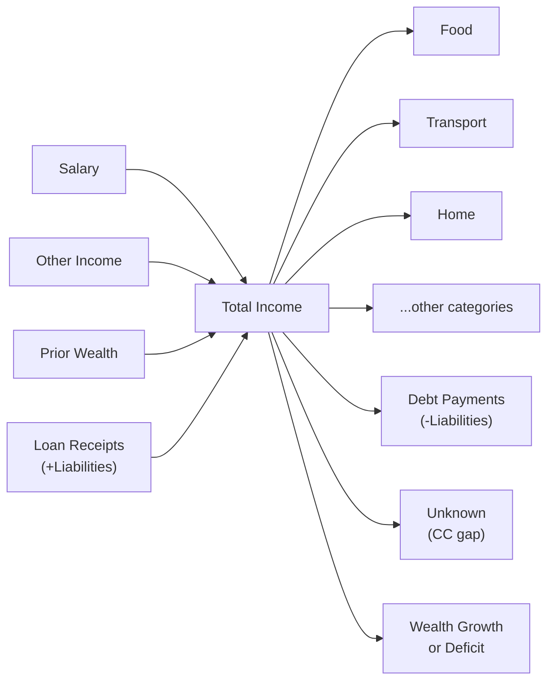

The CC gap (difference between bank CC bill and sum of itemized CC purchases) appears as "Unknown" to maintain the accounting balance.

### Retirement (FIRE) Projections

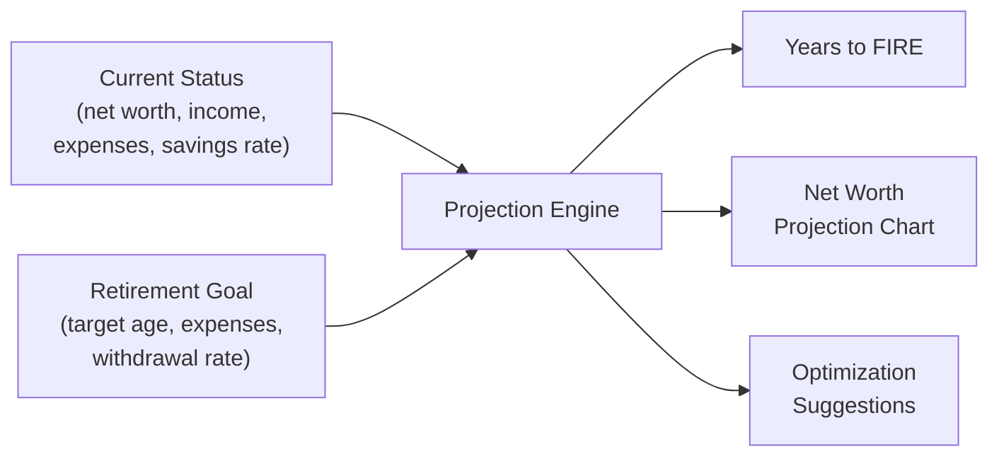

---

## 8. Architectural Rules Summary

1. **Amount sign convention:** negative = money out, positive = money in (everywhere)
2. **CC deduplication:** aggregate KPIs use bank view; category breakdowns use itemized CC view
3. **Prior wealth:** synthetic transaction rows injected into analysis DataFrames
4. **Investment balance:** snapshot-first, transaction-sum fallback
5. **Tagging:** priority-based rules (DESC order), first match wins
6. **Split transactions:** parent excluded, splits included in analysis
7. **Non-expense categories:** Investments, Liabilities (positive only), Income categories, Credit Cards
8. **Expense override:** negative Liabilities (debt payments) count as expenses despite being in a non-expense category
